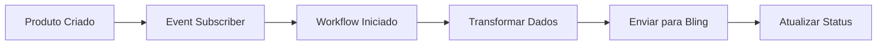
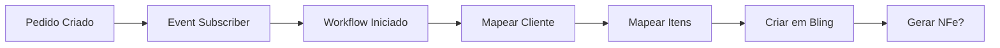
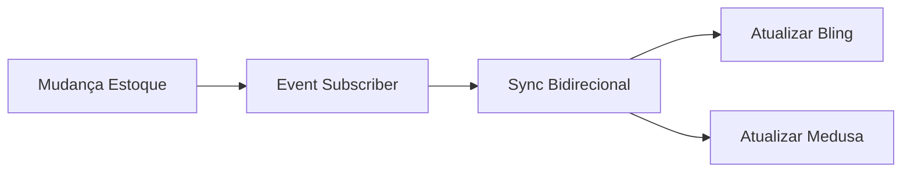

# 🔗 medusa-plugin-bling

[](https://www.npmjs.com/package/medusa-plugin-bling)
[](https://opensource.org/licenses/MIT)
[](http://www.typescriptlang.org/)
[](https://medusajs.com/)
[](./coverage/)

**Integração oficial entre MedusaJS v2.3+ e Bling ERP v3**

Plugin profissional para sincronização bidirecional automática de produtos, pedidos e inventário entre sua loja MedusaJS e o sistema ERP Bling, seguindo todas as melhores práticas e padrões oficiais.

## ✨ Características Principais

- 🔄 **Sincronização Automática**: Produtos, pedidos e inventário sincronizados em tempo real
- 🔐 **OAuth 2.0 + PKCE**: Autenticação segura com refresh automático de tokens
- 📊 **Workflows MedusaJS v2**: Processamento em lotes com rollback automático
- 🎯 **Event-Driven**: Subscribers para automação completa baseada em eventos
- 🛡️ **TypeScript Strict**: 100% tipado sem uso de `any` types
- 🧪 **Testado**: 80%+ cobertura de testes com suíte completa
- 📈 **Monitoramento**: Health checks, métricas e logging estruturado
- 🔒 **Seguro**: Validação HMAC de webhooks e rate limiting

## 🚀 Instalação Rápida

```bash
# NPM
npm install medusa-plugin-bling

# Yarn
yarn add medusa-plugin-bling

# pnpm
pnpm add medusa-plugin-bling
```

## ⚙️ Configuração

### 1. Adição do Plugin

Adicione o plugin ao seu arquivo de configuração do MedusaJS:

```typescript
// medusa-config.js
const plugins = [
  {
    resolve: "medusa-plugin-bling"
    // Todas as configurações são feitas via Admin UI
  }
]
```

### 2. Configuração via Admin Panel

Após instalar o plugin e reiniciar o MedusaJS:

1. **Acesse o Admin Panel** do seu MedusaJS
2. **Navegue para**: Configurações → Integrações → **Bling ERP**
3. **Configure suas credenciais** obtidas no [Portal do Desenvolvedor Bling](https://developer.bling.com.br/):
   - **Client ID**: Seu Client ID do Bling
   - **Client Secret**: Seu Client Secret do Bling
   - **Ambiente**: Sandbox ou Produção
   - **Webhook Secret**: Chave secreta para validação de webhooks

4. **Configure as opções de sincronização**:
   - Produtos (importar imagens, descrições, preços, categorias)
   - Pedidos (envio automático, geração de NFe)
   - Inventário (sincronização bidirecional, intervalo)

> ✨ **Simples e Intuitivo**: Todas as configurações são feitas diretamente no painel administrativo, sem necessidade de variáveis de ambiente ou arquivos de configuração complexos.

### 3. Redis (Recomendado)

```bash
# Docker
docker run -d -p 6379:6379 redis:alpine

# Local
redis-server
```

```env
# .env
REDIS_URL=redis://localhost:6379
```

## 📚 Guia de Uso

### Sincronização Manual

```typescript
// Sincronizar produtos específicos
const { syncProductsWorkflow } = require('medusa-plugin-bling')

await syncProductsWorkflow(container).run({
  input: {
    productIds: ['prod_123', 'prod_456'],
    direction: 'to_bling',
    force: false
  }
})

// Sincronizar pedidos com NFe
const { syncOrdersWorkflow } = require('medusa-plugin-bling')

await syncOrdersWorkflow(container).run({
  input: {
    orderIds: ['order_789'],
    direction: 'to_bling',
    generateNFe: true
  }
})
```

### API Admin

```bash
# Status do plugin
GET /admin/bling

# Iniciar sincronização manual
POST /admin/bling/sync
{
  "entity": "products",
  "direction": "to_bling",
  "limit": 50
}

# Atualizar configuração
PUT /admin/bling/config
{
  "sync_config": {
    "products": { "auto_sync": false }
  }
}
```

### Webhooks

Configure no Bling para receber atualizações:

```
URL: https://sua-loja.com/store/bling-webhook
Eventos: product.*, order.*, inventory.*
```

## 🔄 Fluxos de Sincronização

### Produtos → Bling



**Mapeamento de dados:**
- Variações → Bling Variações
- Imagens → Bling Mídia
- Categorias → Bling Categorias
- Preços → Conversão BRL
- Inventário → Estoque Bling

### Pedidos → Bling



**Recursos avançados:**
- Geração automática de NFe
- Mapeamento de formas de pagamento
- Cálculo de frete e impostos
- Status de fulfillment

### Inventário ↔ Bling



## 🛠️ Desenvolvimento

### Pré-requisitos

```bash
Node.js 18+
TypeScript 4.9+
MedusaJS v2.3+
Redis (opcional, recomendado)
```

### Setup Local

```bash
# Clone o repositório
git clone https://github.com/seu-usuario/medusa-plugin-bling.git
cd medusa-plugin-bling

# Instalar dependências
npm install

# Configurar ambiente
cp .env.example .env

# Executar testes
npm test

# Build
npm run build

# Linting
npm run lint

# Type check
npm run typecheck
```

### Estrutura do Projeto

```
src/
├── api/                    # API routes
│   ├── admin/             # Admin endpoints
│   ├── store/             # Store endpoints
│   └── middlewares/       # Custom middlewares
├── jobs/                  # Scheduled jobs
├── modules/               # Core modules
│   └── bling/            # Bling service
├── providers/             # Service providers
├── subscribers/           # Event subscribers
├── workflows/             # Business workflows
│   ├── sync-products/    # Product sync
│   └── sync-orders/      # Order sync
├── __tests__/            # Test suite
└── index.ts              # Plugin entry
```

### Executar Testes

```bash
# Todos os testes
npm test

# Com coverage
npm run test:coverage

# Apenas unitários
npm run test:unit

# Apenas integração
npm run test:integration

# Watch mode
npm run test:watch
```

## 📊 Monitoramento

### Health Check

```bash
curl https://sua-loja.com/admin/bling
```

```json
{
  "success": true,
  "data": {
    "status": "healthy",
    "details": {
      "authentication": "ok",
      "database": "ok",
      "cache": "ok",
      "api": "ok",
      "rateLimit": {
        "limit": 300,
        "remaining": 250,
        "reset": "2025-01-24T23:59:59Z"
      }
    }
  }
}
```

### Logs Estruturados

```json
{
  "timestamp": "2025-01-24T10:30:00Z",
  "level": "info",
  "message": "Product synced successfully",
  "context": {
    "productId": "prod_123",
    "blingId": "12345",
    "operation": "create"
  }
}
```

### Métricas Disponíveis

- ✅ Taxa de sucesso de sincronização
- ⏱️ Tempo médio de processamento
- 🔄 Número de operações por hora
- ⚠️ Erros e falhas por tipo
- 📈 Rate limiting e quotas da API

## 🔧 Personalização

### Workflows Customizados

```typescript
// custom-sync.ts
import { createWorkflow } from "@medusajs/framework/workflows-sdk"
import { syncProductsWorkflow } from "medusa-plugin-bling"

export const customProductSync = createWorkflow(
  "custom-product-sync",
  function (input) {
    // Sua lógica customizada
    const products = getProductsStep(input.productIds)
    const enrichedProducts = enrichProductsStep(products)
    return syncProductsWorkflow({ products: enrichedProducts })
  }
)
```

### Subscribers Personalizados

```typescript
// custom-subscriber.ts
import { SubscriberConfig } from "@medusajs/framework"

export default async function customProductSubscriber(args) {
  // Sua lógica personalizada antes da sincronização
  console.log('Produto modificado:', args.event.data)

  // Chamar subscriber original se necessário
}

export const config: SubscriberConfig = {
  event: ['product.updated']
}
```

## 🚨 Solução de Problemas

### Problemas Comuns

**❌ Erro de Autenticação**
```bash
Error: Bling authentication failed
```
Solução: Verifique `BLING_CLIENT_ID` e `BLING_CLIENT_SECRET`

**❌ Webhook Inválido**
```bash
Error: Invalid webhook signature
```
Solução: Confirme `BLING_WEBHOOK_SECRET` no portal do Bling

**❌ Rate Limit**
```bash
Error: Rate limit exceeded
```
Solução: O plugin tem retry automático, aguarde ou contate o Bling

**❌ Produto não encontrado**
```bash
Error: Product not found in Bling
```
Solução: Use `force: true` ou verifique se o produto existe

### Debug

```bash
# Ativar logs detalhados
DEBUG=bling:* npm start

# Verificar health status
curl -X GET /admin/bling

# Testar webhook
curl -X POST /store/bling-webhook \
  -H "Content-Type: application/json" \
  -H "X-Bling-Signature: sha256=..." \
  -d '{"topic":"product.updated","data":{"id":"123"}}'
```

## 📋 Roadmap

### v3.0.0 (Atual)
- ✅ MedusaJS v2.3+ compatibility
- ✅ TypeScript strict mode
- ✅ OAuth 2.0 + PKCE
- ✅ Workflows & Event Subscribers
- ✅ 80%+ test coverage

### v3.1.0 (Próxima)
- 🔄 Admin UI Dashboard
- 📅 Scheduled Jobs
- 🔍 Busca e filtros avançados
- 📊 Relatórios e analytics

### v3.2.0 (Futuro)
- 🎨 Customização de mapeamentos
- 🔌 Webhooks bidirecionais
- 📱 Notificações em tempo real
- 🌐 Multi-tenant support

## 🤝 Contribuindo

Contribuições são bem-vindas! Veja [CONTRIBUTING.md](./CONTRIBUTING.md).

### Processo

1. Fork o projeto
2. Crie uma branch: `git checkout -b feature/nova-funcionalidade`
3. Commit: `git commit -m 'feat: adicionar nova funcionalidade'`
4. Push: `git push origin feature/nova-funcionalidade`
5. Abra um Pull Request

### Padrões

- 🔍 Testes obrigatórios (80%+ coverage)
- 📏 ESLint + Prettier
- 📝 Conventional Commits
- 🏷️ TypeScript strict
- 📚 Documentação atualizada

## 📄 Licença

Este projeto está sob a licença MIT. Veja [LICENSE](./LICENSE) para detalhes.

## 🆘 Suporte

- 📧 **Email**: suporte@medusa-plugin-bling.com
- 🐛 **Issues**: [GitHub Issues](https://github.com/seu-usuario/medusa-plugin-bling/issues)
- 💬 **Discord**: [Comunidade MedusaJS](https://discord.gg/medusajs)
- 📖 **Docs**: [Documentação Completa](https://docs.medusa-plugin-bling.com)

## 🔗 Links Úteis

- [MedusaJS v2 Docs](https://docs.medusajs.com/)
- [Bling API v3 Docs](https://developer.bling.com.br/)
- [Plugin Registry](https://medusajs.com/plugins/)
- [TypeScript Handbook](https://www.typescriptlang.org/docs/)

---

**Feito com ❤️ para a comunidade MedusaJS**

Se este plugin foi útil, considere dar uma ⭐ no GitHub!